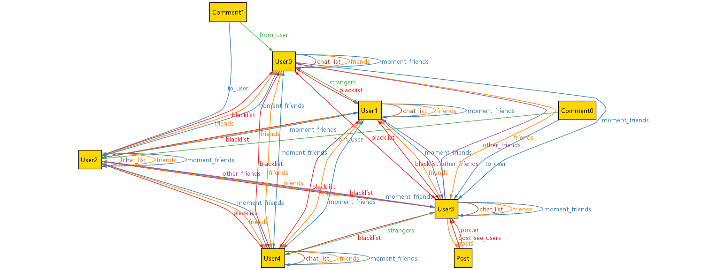

# 作业九：利用Alloy进行建模与验证

<center>唐亚周 519021910804</center>

我选择的约束条目如下

> 1.1 任何人只能看到自己的好友发的照片（前提是你没有屏蔽对方，对方也没有屏蔽你）。
> 1.2 你只能看你的好友对你的好友的评论，而不能看到你不认识的人对你的好友的评论。
> 1.3 你看不到你的好友单独回复给你不认识的人的评论。
> 2.2 微信把对方列入黑名单，未删除好友。在对方的通讯录好友列表中仍然会显示，对方无需添加好友关系。
> 2.3 在自己的会话列表不再显示与其聊天记录，解除黑名单后会重新出现在会话列表中；
> 2.9 互相看不到朋友圈更新，拉黑之前在朋友圈分享的照片也不在对方朋友圈展示。

首先是 3 个 signature 的定义，其具体含义都写在注释中。

```alloy
sig Post {
    poster: User,               // 发帖人
    comments: set Comment,      // 评论
    post_see_users: set User    // 可以看到这条帖子的用户
} {
    post_see_users = poster.moment_friends  // 可以看到这条帖子的用户是发帖人的「朋友圈可见的好友」
}

sig Comment {
    from_user, to_user: User,   // 评论人和被评论人
    comment_see_users: set User // 可以看到这条评论的用户
} {
    comment_see_users = (from_user.friends - from_user.blacklist) & (to_user.friends - to_user.blacklist) // 可以看到这条评论的用户是评论人的「全部好友」减去发帖人的「黑名单」与被评论人的「全部好友」减去被评论人的「黑名单」的交集
}

sig User {
    friends: set User,          // 全部好友
    moment_friends: set User,   // 朋友圈可见的好友
    other_friends: set User,    // 朋友圈不可见的好友
    blacklist: set User,        // 黑名单
    posts: set Post,            // 朋友圈中发布的帖子
    chat_list: set User,        // 聊天列表
    strangers: set User,        // 陌生人（除了好友以外的其它所有用户）
} {
    friends = moment_friends + other_friends    // 「全部好友」是「朋友圈可见的好友」加上「朋友圈不可见的好友」
    chat_list = friends - blacklist             // 「聊天列表」是「全部好友」减去「黑名单」
}
```

然后定义 5 条 fact，代表的意思如下

* `p` 在 `u` 的「朋友圈中发布的帖子」中，当且仅当 `u` 是 `p` 的「发帖人」；
* `u` 在它自己的「朋友圈可见的好友」中；
* `u` 在 `u1` 的 「全部好友」中，当且仅当 `u1` 在 `u` 的「全部好友」中；
* `u` 在 `u1` 的 「全部好友」中，当且仅当 `u` 不在 `u1` 的「陌生人」中；
* `u` 不在自己的 「黑名单」中。

```alloy
fact {
    all u: User, p: Post | p in u.posts <=> u = p.poster
    all u: User | u in u.moment_friends
    all u, u1: User | u in u1.friends <=> u1 in u.friends
    all u, u1: User | u in u1.friends <=> not u in u1.strangers
    no u: User | u in u.blacklist
}
```

然后描述将一个好友加入到黑名单的过程，及将一个黑名单成员恢复成一个好友的过程。

```alloy
pred addToBlacklist(u, u", u1: User) {
    u1 in u.friends
    u != u1
    not u1 in u.blacklist
    u".blacklist = u.blacklist + {u1}
    u".moment_friends = u.moment_friends - {u1}
    u".friends = u.friends
}

pred removeFromBlacklist(u, u", u1: User) {
    u1 in u.friends
    u1 in u.blacklist
    u != u1
    u".blacklist = u.blacklist - {u1}
    u".friends = u.friends
}
```

然后使用断言进行检验，这里我定义了 3 个断言，均检验通过。它们表示的意思如下。

* `u` 把 `u1` 加入「黑名单」后，得到的 `u"` 的「聊天列表」中也把 `u1` 去掉了；
* `u` 把 `u1` 从「黑名单」恢复后，得到的 `u"` 的「聊天列表」中也加上了 `u1`；
* `u` 把 `u1` 加入「黑名单」后，`u1` 一定不在得到的 `u"` 的「朋友圈可见的好友」中；

```alloy
addToBlacklistNoChat: check {
    all u, u", u1: User |
        addToBlacklist[u, u", u1] => u".chat_list = u.chat_list - {u1}
} for 50

removeFromBlacklistNoChat: check {
    all u, u", u1: User |
        removeFromBlacklist[u, u", u1] => u".chat_list = u.chat_list + {u1}
} for 50

addToBlacklistNoMoment: check {
    all u, u", u1: User |
        addToBlacklist[u, u", u1] => not u1 in u".moment_friends
} for 50
```

最后运行一个 predicate 来进行结果展示。

```alloy
pred example {
    all u: User | #u.friends > 3 and #u.blacklist > 3
}

run example for exactly 5 User, 10 Post, 20 Comment
```


